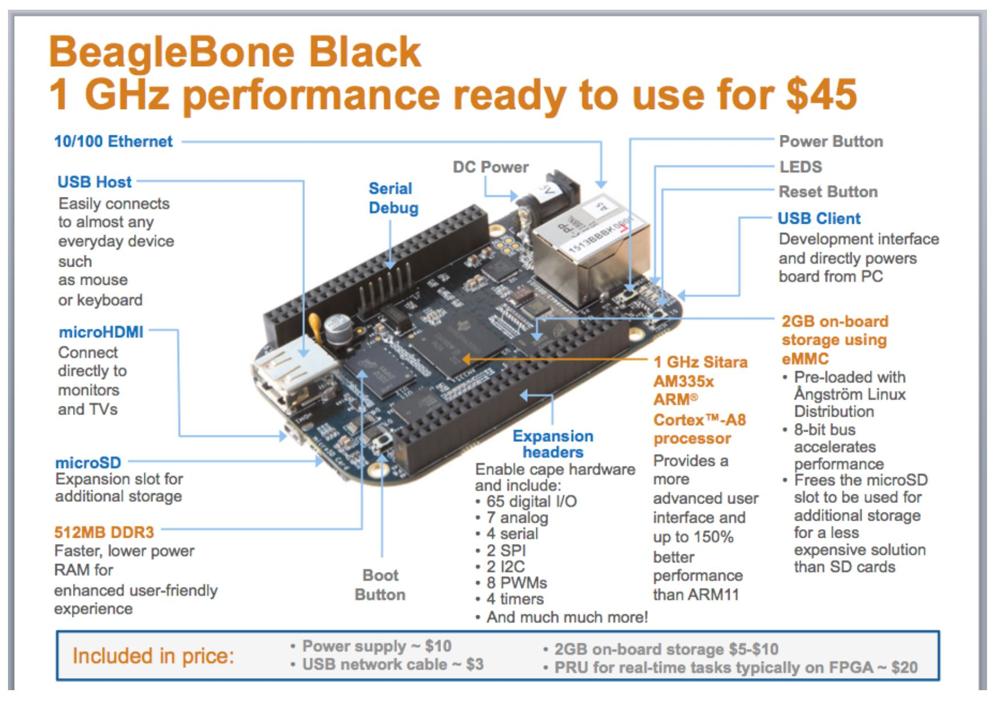
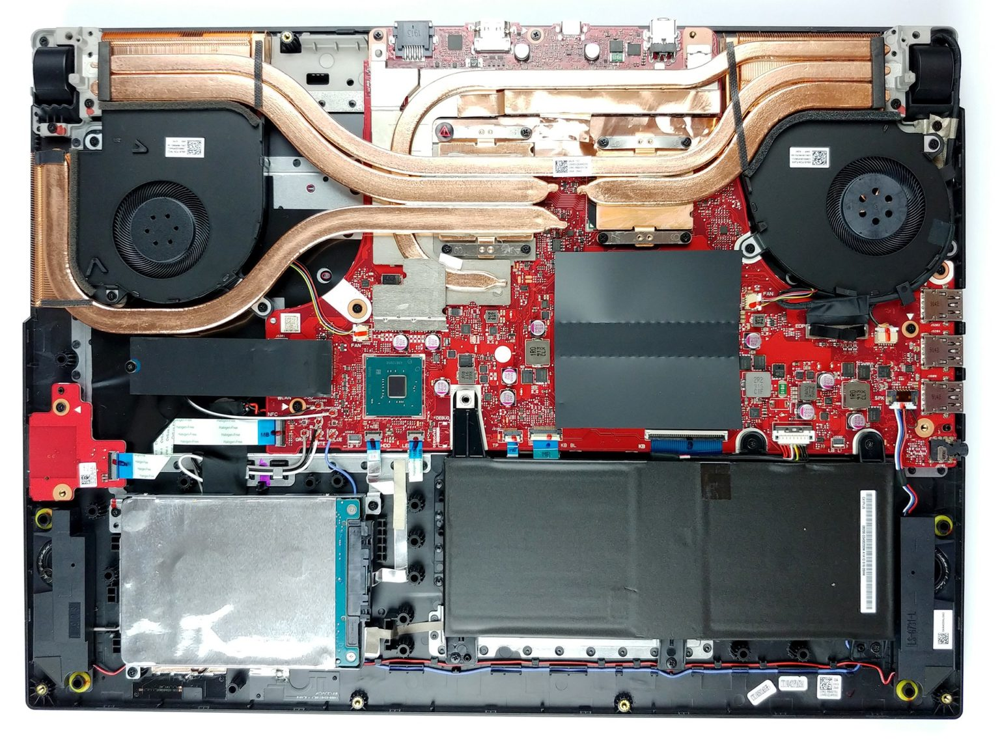
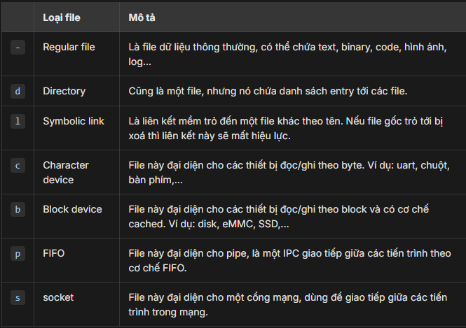

## BUỔI 1: TỔNG QUAN EMBEDDED LINUX - CÀI MÔI TRƯỜNG

```
- VMWare 17.6.4: Cài máy ảo ubuntu (1)
- Ubuntu: Ubuntu 22.04.5 (2)
- VSCode: Remote + edit code
- Mobaxterm: Remote
```

(1) https://drive.google.com/file/d/1FZrVcQupYah6wI51ypD-hOq5TAdX6Rfd/edit
(2) https://releases.ubuntu.com/jammy/



### 1.1 Hệ thống nhúng là gì

EX: ASUS ROGSTRIG G512


- CPU (Quan trọng nhất) (Clock)
- Ngoại vi (Monitor, Battery, Fan, USBx,...)

### 1.2 Công việc thường làm Embedded Linux

- Bootloader: Tối ưu time khởi chạy
- Linux Kernel: Viết driver: I2C/SPI/USB/CAN/...
- Rootfs: Phát triển ứng dụng trên tầng user space

EX: Công ty phát triển thiết bị Laptop ABC

```cpp
- Designed (Bỏ những cái không cần thiết)
- Tối ưu lại các thành phần của hệ thống (bootloader, kernel, app)
```

### 1.3 SRC

```cpp
https://elixir.bootlin.com/linux/v6.19.3/source/kernel
```

## BUỔI 2: VIM - SSH - BUILD

### 2.1 SSH

Cài packet

```cpp
sudo apt install openssh-server: Cài gói openssh-server
```

sudo: mượn quyền cao nhất (root)
openssh-server: packet -> ssh remote từ device khác

### 2.2 CMD

```
uname -a : ra phiên bản
```

```
pwd : Lấy ra đường dẫn hiện tại
```

```
touch abc.txt : Tạo file abc.txt
```

```
echo "hello hoc cung et" > abc.txt : ghi vô file abc.txt
```

```
cat abc.txt : View file
```

```
cd folderA : Di chuyển vào thư mục A
```

```
cd ../ : Lùi thư mục
```

```
ls : In ra những thứ các file trong folder
```

```
ls -l : Lấy ra nhiều thông tin hơn
```

```
ls -a : lấy ra cả file ẩn
```

```
rm -rf abc.txt : Xóa luôn file (không có trong thùng rác)
```

### 2.3 VIM

```
vim abc.txt - Tạo file abc.txt và mở trình soạn thảo vim
-------------------------------
i: mode insert - sửa đổi file
ESC + :wq - lưu và thoát
ESC + !q - thoát và không lưu
ESC + w - lưu
:set number - hiển thị number
-------------------------------
shift + g: di chuyển về cuối file
g + g: di chuyển về đầu file
d + d: xóa 1 dòng
```

### 2.4 Hello world

```
gcc -o filerun main.c
```

## BUỔI 3: MAKEFILE

Tham khảo seri makeFile
😎 https://www.youtube.com/playlist?list=PLbQ6BBf-QSJwjnLCxxZioumIBd3HKZSXY

Makefile là 1 script bên trong chứa các thông tin như

- cấu trúc dự án
- các cmd để build, clean,...

Ví dụ
script build project

```
gcc -o main main.c
```

Có thể thấy nếu có nhiều file chúng ta sẽ dùng các cmd build rất nhiều -> dùng makefile

```
all
    gcc -c main main.c -I.
clean
    rm -rf main
```

## BUỔI 4: FILE SYSTEM

Một chương trình đang chạy trên linux thì bản thân chương trình đấy cũng phải được biểu diễn thông qua một file nào đấy trong hệ thống, ta có thể thao tác với chương trình thông qua file. Hoặc một ví dụ như chuột, bàn phím, màn hình, âm thanh cũng đều được đại diện bằng một file nào đó và ta có thể thao tác với âm thanh hoặc đọc ghi qua màn hình thì đều có thể thông qua các file đại diện cho nó.

=> Linux quản lý mọi thứ thông qua file.

### 4.1 Các loại file

```cpp
$ ls -l /
drwxr-xr-x   2 root root  4096 Oct  9  /bin
lrwxrwxrwx   1 root root     7 Oct  9  /lib -> usr/lib
brw-rw----   1 root disk 8,  0 Oct  9  /dev/sda
crw-rw-rw-   1 root tty  5,  0 Oct  9  /dev/tty
-rw-r--r--   1 root root  189 Oct  9  /etc/fstab

```



```cpp
Regular: File thông thường ý
Dir: Kiểu là folder ý
Link file: Như kiểu shortcut ý
```

### 4.2 Quyền truy cập file (permission bits)

Phần còn lại của cột đầu tiên cho biết quyền sử dụng file đó:

- Mỗi ký tự đại diện cho một quyền.
- Mỗi quyền lại được đại diện bởi một bit trong struct mode_t.
- Các quyền này được gom theo từng nhóm: User, Group và Other.
- Mỗi nhóm sẽ có 3 loại quyền là:
  - read r: Cho phép đọc nội dung file hoặc xem file trong thư mục.
  - write w: Cho phép ghi nội dung vào file hoặc xoá file trong thư mục.
  - execute x: Cho phép thực thi file hoặc truy cập vào thư muc (cd).
  - Ký tự - cho biết nó không có quyền tương ứng.

=> Tóm lại quyền cho một file sẽ được đại diện bởi các bit gồm: 3 bit đặc biệt, 3 bit user, 3 bit group và 3 bit other

Luôn có 1 user (root) có quyền hạn cao nhất
Thằng này thì muốn làm gì cũng được
Để chuyển sang root dùng cmd

```cpp
sudo su
```

### 4.3 Hiểu về file

Command lấy ra toàn bộ thông tin file

```cpp
ls -l
```
