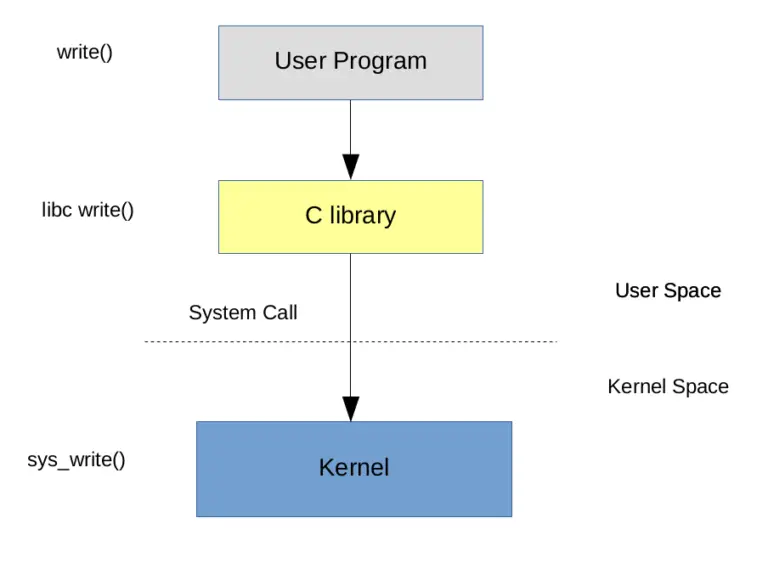
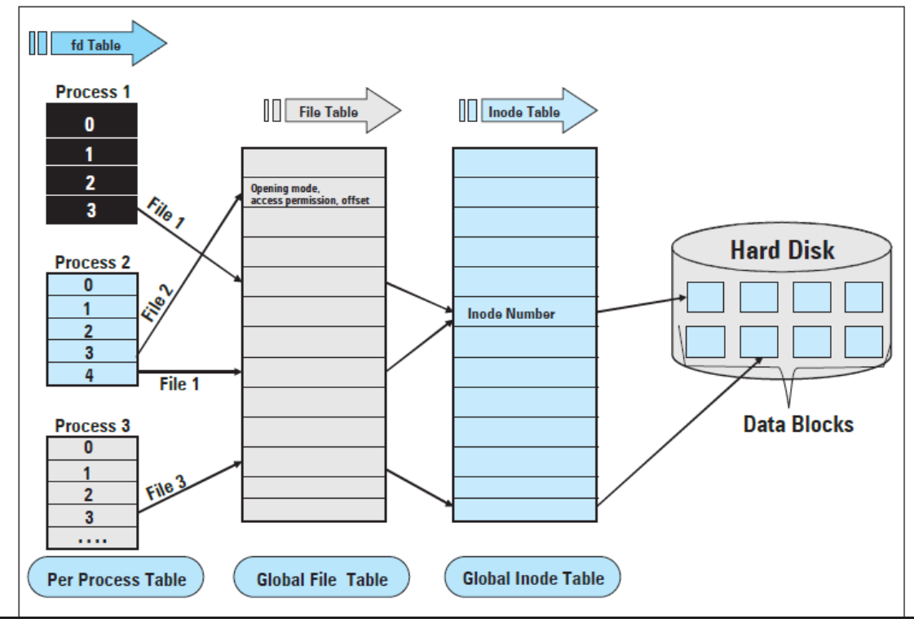
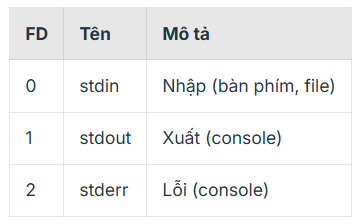
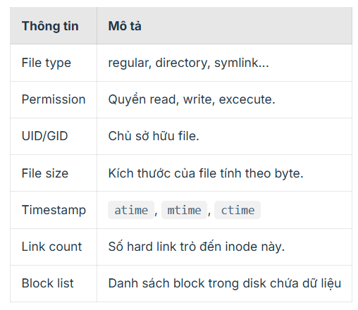
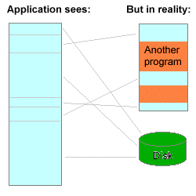
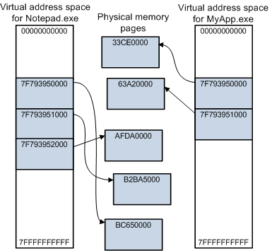

## BUỔI 1: TỔNG QUAN EMBEDDED LINUX - CÀI MÔI TRƯỜNG

```
- VMWare 17.6.4: Cài máy ảo ubuntu (1)
- Ubuntu: Ubuntu 22.04.5 (2)
- VSCode: Remote + edit code
- Mobaxterm: Remote
```

(1) https://drive.google.com/file/d/1FZrVcQupYah6wI51ypD-hOq5TAdX6Rfd/edit
<br>
(2) https://releases.ubuntu.com/jammy/


### 1.1 Hệ thống nhúng là gì

EX: ASUS ROGSTRIG G512


- CPU (Quan trọng nhất) (Clock)
- Ngoại vi (Monitor, Battery, Fan, USBx,...)

### 1.2 Công việc thường làm Embedded Linux

- Bootloader: Tối ưu time khởi chạy
- Linux Kernel: Viết driver: I2C/SPI/USB/CAN/...
- Rootfs: Phát triển ứng dụng trên tầng user space

EX: Công ty phát triển thiết bị Laptop ABC

```cpp
- Designed (Bỏ những cái không cần thiết)
- Tối ưu lại các thành phần của hệ thống (bootloader, kernel, app)
```

### 1.3 SRC

```cpp
https://elixir.bootlin.com/linux/v6.19.3/source/kernel
```

## BUỔI 2: VIM - SSH - BUILD

### 2.1 SSH

Cài packet

```cpp
sudo apt install openssh-server: Cài gói openssh-server
```

sudo: mượn quyền cao nhất (root)
openssh-server: packet -> ssh remote từ device khác

### 2.2 CMD

```
uname -a : ra phiên bản
```

```
pwd : Lấy ra đường dẫn hiện tại
```

```
touch abc.txt : Tạo file abc.txt
```

```
echo "hello hoc cung et" > abc.txt : ghi vô file abc.txt
```

```
cat abc.txt : View file
```

```
cd folderA : Di chuyển vào thư mục A
```

```
cd ../ : Lùi thư mục
```

```
ls : In ra những thứ các file trong folder
```

```
ls -l : Lấy ra nhiều thông tin hơn
```

```
ls -a : lấy ra cả file ẩn
```

```
rm -rf abc.txt : Xóa luôn file (không có trong thùng rác)
```

### 2.3 VIM

```
vim abc.txt - Tạo file abc.txt và mở trình soạn thảo vim
-------------------------------
i: mode insert - sửa đổi file
ESC + :wq - lưu và thoát
ESC + !q - thoát và không lưu
ESC + w - lưu
:set number - hiển thị number
-------------------------------
shift + g: di chuyển về cuối file
g + g: di chuyển về đầu file
d + d: xóa 1 dòng
```

### 2.4 Hello world

```
gcc -o filerun main.c
```

## BUỔI 3: MAKEFILE

Tham khảo seri makeFile
😎 https://www.youtube.com/playlist?list=PLbQ6BBf-QSJwjnLCxxZioumIBd3HKZSXY

Makefile là 1 script bên trong chứa các thông tin như

- cấu trúc dự án
- các cmd để build, clean,...

Ví dụ
script build project

```
gcc -o main main.c
```

Có thể thấy nếu có nhiều file chúng ta sẽ dùng các cmd build rất nhiều -> dùng makefile

```
all
    gcc -c main main.c -I.
clean
    rm -rf main
```

## BUỔI 4: FILE SYSTEM

Một chương trình đang chạy trên linux thì bản thân chương trình đấy cũng phải được biểu diễn thông qua một file nào đấy trong hệ thống, ta có thể thao tác với chương trình thông qua file. Hoặc một ví dụ như chuột, bàn phím, màn hình, âm thanh cũng đều được đại diện bằng một file nào đó và ta có thể thao tác với âm thanh hoặc đọc ghi qua màn hình thì đều có thể thông qua các file đại diện cho nó.

=> Linux quản lý mọi thứ thông qua file.

### 4.1 Các loại file

```cpp
$ ls -l /
drwxr-xr-x   2 root root  4096 Oct  9  /bin
lrwxrwxrwx   1 root root     7 Oct  9  /lib -> usr/lib
brw-rw----   1 root disk 8,  0 Oct  9  /dev/sda
crw-rw-rw-   1 root tty  5,  0 Oct  9  /dev/tty
-rw-r--r--   1 root root  189 Oct  9  /etc/fstab

```


```cpp
Regular: File thông thường ý
Dir: Kiểu là folder ý
Link file: Như kiểu shortcut ý
```

### 4.2 Quyền truy cập file (permission bits)

Phần còn lại của cột đầu tiên cho biết quyền sử dụng file đó:

- Mỗi ký tự đại diện cho một quyền.
- Mỗi quyền lại được đại diện bởi một bit trong struct mode_t.
- Các quyền này được gom theo từng nhóm: User, Group và Other.
- Mỗi nhóm sẽ có 3 loại quyền là:
  - read r: Cho phép đọc nội dung file hoặc xem file trong thư mục.
  - write w: Cho phép ghi nội dung vào file hoặc xoá file trong thư mục.
  - execute x: Cho phép thực thi file hoặc truy cập vào thư muc (cd).
  - Ký tự - cho biết nó không có quyền tương ứng.

=> Tóm lại quyền cho một file sẽ được đại diện bởi các bit gồm: 3 bit đặc biệt, 3 bit user, 3 bit group và 3 bit other

Để set quyền dùng cmd

```cpp
chmod 755 file   # rwxr-xr-x
chmod 644 file   # rw-r--r--
chmod 700 file   # rwx------
```

Luôn có 1 user (root) có quyền hạn cao nhất
Thằng này thì muốn làm gì cũng được
Để chuyển sang root dùng cmd

```cpp
sudo su
```

### 4.3 Hiểu về file

Command lấy ra thông tin file

```cpp
ls -l
```

### 4.4 System call

```cpp
https://man7.org/linux/man-pages/man2/open.2.html
```



##### 4.4.1 Các system call basic về file

```
read() -> Đọc file
write()-> Ghi file
lseek() -> Thay đổi vị trí đọc/ghi
close() -> Đóng file
```

Ví dụ:

```cpp
#include <stdio.h>
#include <fcntl.h>    // open
#include <unistd.h>   // read, write, close
#include <string.h>

int main() {
    int fd;
    char buffer[100];

    // Mở file (O_CREAT - nếu chưa có thì tạo, O_RDWR - cả read và write)
    fd = open("test.txt", O_RDWR | O_CREAT, 0644);
    if (fd < 0) {
        perror("open failed");
        return 1;
    }

    // Ghi dữ liệu vào file
    char *msg = "Hello Hoc Cung ET!\n";
    write(fd, msg, strlen(msg));

    // Đưa con trỏ file về đầu để đọc lại
    lseek(fd, 0, SEEK_SET);

    // Đọc dữ liệu từ file
    int bytes = read(fd, buffer, sizeof(buffer) - 1);
    if (bytes < 0) {
        perror("read failed");
        return 1;
    }

    buffer[bytes] = '\0';
    printf("Data:\n%s", buffer);

    // Close file
    close(fd);

    return 0;
}
```

### 4.5 Fd & File Table & Inode table



#### 4.5.1 Fd - File descriptor

File descriptor hay fd là một số nguyên dương trỏ tới một struct file trong kernel và mỗi process sẽ có một bảng file descriptor table riêng.

stdin, stdout, stderr là 3 file descriptor mặc định được hệ điều hành mở sẵn ngay khi process được khởi tạo.



#### 4.5.2 Inode table

Để kernel biết được thông tin của một file như thời gian tạo, loại, quyền, block chứa dữ liệu của file thì làm kiểu gì? Câu trả lời chính là thông qua inode.

Vậy thì inode là gì?

- Inode hay index node là một cấu trúc dữ liệu được lưu trên disk dùng để lưu thông tin metadata của một file

- Mỗi file có một inode duy nhất được đánh số gọi là inode number.

Một inode thường chứa các thông tin sau:


Ví dụ:

```cpp
$ ls -i
1052 file.txt
1053 note.txt
```

→ file.txt có inode number = 1052
→ note.txt có inode number = 1053

Để kiểm tra thông tin của một file, ta sử dụng lệnh sau:

```cpp
$ stat file.txt
File: file.txt
Size: 1024          Blocks: 8          IO Block: 4096   regular file
Device: 803h/2051d    Inode: 1052        Links: 1
Access: .....
Access: 2025-10-09 13:12:03
Modify: 2025-10-09 13:12:03
Change: 2025-10-09 13:12:03
```

Hard link

```cpp
$ ln file.txt file_link
$ ls -li
1052 -rw-r--r-- 2 user user 1024 Oct 9 file.txt
1052 -rw-r--r-- 2 user user 1024 Oct 9 file_link
```

- Cả hai đều trỏ đến inode 1052, chia sẻ cùng dữ liệu.
- Xóa một file, file kia vẫn tồn tại (vì link count > 0).

Symbolic link

```cpp
$ ln -s file.txt sym_link
$ ls -li
1052 -rw-r--r-- 1 user user 1024 Oct 9 file.txt
1053 lrwxrwxrwx 1 user user   8 Oct 9 sym_link -> file.txt
```

- sym_link có inode khác (1053).
- Chỉ chứa đường dẫn đến file gốc, không trỏ trực tiếp vào block dữ liệu.
- Khi file gốc xoá, symlink chết hay dangling.

#### 4.5.3 File Table

File table là một bảng chứa thông tin của một file đang mở trong hệ thống:

- Con trỏ tới inode
- Offset hiện tại
- Cờ mở file
- Con trỏ file_operations
- Referenct count: số process đang sử dụng file này.

Mỗi process có thể mở cùng một file, nhưng sẽ có entry trong file table khác nhau nếu nó có offset hoặc cờ mở file khác nhau.

## BUỔI 5: VIRTUAL MEMORY

### 5.1 Cơ chế swapping (hoán đổi giữa RAM và disk)

Trong cơ chế này, những phần dữ liệu ít được sử dụng sẽ được chuyển từ RAM vào disk, trong khi những phần dữ liệu hay được sử dụng sẽ nằm trong RAM. Cơ chế này giúp hệ thống 100MB RAM có thể hỗ trợ các ứng dụng yêu cầu đến 1GB bộ nhớ.

Chương trình máy tính tưởng rằng nó có một dải dài các địa chỉ liên tục trong bộ nhớ; nhưng trong thực tế một số phần đang được sử dụng nằm rải rác trong RAM, còn các phần tạm thời không dùng đến được lưu trữ trong một file trên đĩa cứng.

Khi ở user mode, mỗi tiến trình sẽ có một không gian địa chỉ bộ nhớ riêng, điều này làm cho:

- Tiến trình A không thể đọc hoặc ghi vào địa chỉ bộ nhớ của tiến trình B
- Ngay cả khi cả hai có cùng địa chỉ ảo (ví dụ 0x7F793950000), chúng sẽ trỏ đến 2 physical address khác nhau.



→ Giúp kernel ngăn việc tiến trình A đọc hoặc ghi trái phép vào các vùng nhớ không thuộc về nó.

### 5.2 Tính chất

Virtual memory có một vài lợi ích tính chất như sau

```
- Abstraction: Giấu đi chi tiết vật lý
- Efficiency: Tăng hiệu quả dùng RAM
- Protection : Bảo vệ truy cập
```

#### 5.2.1 Abstraction

Trước khi có virtual memory, tiến trình phải biết mình nằm ở chỗ nào trong bộ nhớ vật lý. Giờ thì tiến trình sẽ chỉ biết về địa chỉ ảo mà không biết gì về địa chỉ vật lý của nó. Điều này sẽ được kernel ánh xạ thông qua cơ chế page table.

→ Địa chỉ ảo của một biến cố định nhưng địa chỉ vậy lý tương ứng có thể bị thay đổi.

Ví dụ: Biến A có địa chỉ ảo là 0x10. Tuỳ thuộc vào OS thì địa chỉ vật lý của nó có thể thay đổi là 0x20, 0x30,...

Ngoài ra, chương trình chạy ở user mode sẽ không có bất kỳ phương pháp nào để có thể biết được địa chỉ vật lý của nó, trừ khi nó thực hiện system call xuống driver để driver đọc địa chỉ vật lý.

#### 5.2.2 Efficiency – Tăng hiệu quả dùng RAM

Nhờ cơ chế page của virtual memory:

Mỗi tiến trình chỉ nạp những phần thực sự cần vào RAM.
Phần còn lại có thể swap ra disk.
Nhiều tiến trình có thể chia sẻ cùng một physical page như shared library.
→ Virtual memory cho phép “RAM logic” lớn hơn “RAM thật”.

#### 5.2.3 Protection – Bảo vệ truy cập

Mỗi page trong page table có bit quyền:

Read / Write / Execute
User / Supervisor
Nếu chương trình vi phạm (ví dụ ghi vào page read-only hoặc truy cập trái phép vào không gian hệ thống), CPU sinh ra page fault → kernel xử lý hoặc kill process.

### 5.3 Page table
